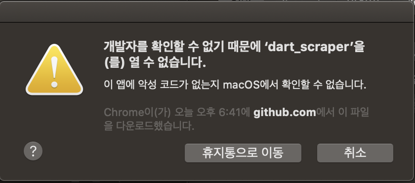
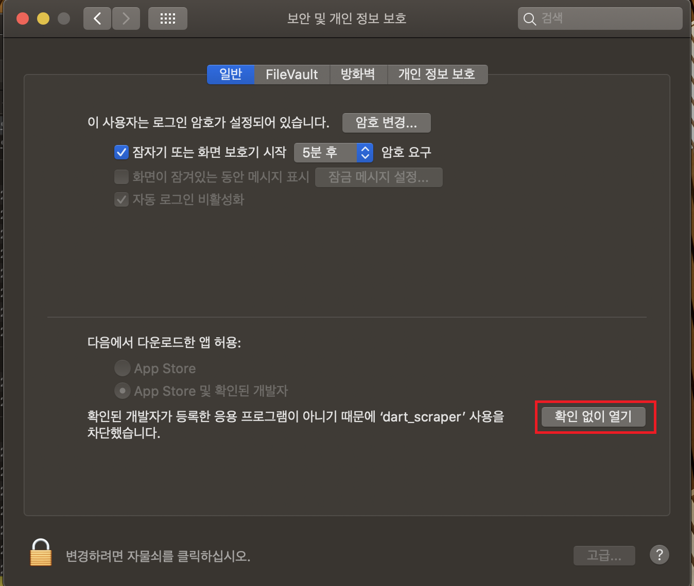

# Dart Scraper

[Dart-Fss](https://github.com/josw123/dart-fss) 모듈을 이용한 재무제표 추출 프로그램

## Download

[Download Link](https://github.com/josw123/dart-scraper/releases)

## Version History
- v0.4.3
  - [Dart-Fss](https://github.com/josw123/dart-fss) 라이브러리 v0.3.10 사용 ([Update 정보](https://github.com/josw123/dart-fss/releases/tag/v0.3.10))
  - 일부 컬럼의 이름이 중복되는 문제로 인하여 발생하는 오류 해결(#20)
  - 사업보고서제출기한연장신고서에 의해 발생하는 오류 수정([#64](https://github.com/josw123/dart-fss/issues/64))

- v0.4.2
  - [Dart-Fss](https://github.com/josw123/dart-fss) 라이브러리 v0.3.4 사용 ([Update 정보](https://github.com/josw123/dart-fss/releases/tag/v0.3.4))
  - 'LG화학' 당기순이익(ifrs-full_ProfitLoss) 일부 추출 되지 않는 이슈 해결([#45](https://github.com/josw123/dart-fss/issues/45))
  - 재무제표 추출시 부호가 반대로 추출되는 문제 해결([#44](https://github.com/josw123/dart-fss/issues/44))

- v0.4.1
  - [Dart-Fss](https://github.com/josw123/dart-fss) 라이브러리 v0.3.2 사용 ([Update 정보](https://github.com/josw123/dart-fss/releases/tag/v0.3.2))
  - 코스피, 코스닥, 코덱스에 상장된 기업만 검색할 수 있는 옵션 추가
  - 신규 상장된 기업의 재무제표 추출시 발상해는 오류 수정 ([dart-fss 오류 #28](https://github.com/josw123/dart-fss/issues/28))
  
- v0.4.0
  - [Dart-Fss](https://github.com/josw123/dart-fss) 라이브러리 v0.3.0a 사용 ([Update 정보](https://github.com/josw123/dart-fss/releases/tag/v0.3.0a))
  - Open DART 및 DART 홈페이지 서비스 제한 방지를 위한 딜레이 추가([관련 공지사항](https://bit.ly/2wcnz2y>))

- v0.3.0
  - [Dart-Fss](https://github.com/josw123/dart-fss) 라이브러리 v0.2.4 사용 ([Update 정보](https://github.com/josw123/dart-fss/releases/tag/v0.2.4))

- v0.2.3
  - 재무제표 추출 속도 개선
  - [Dart-Fss](https://github.com/josw123/dart-fss) 라이브러리 v0.1.9 사용 ([Update 정보](https://github.com/josw123/dart-fss/releases/tag/v0.1.9))

- v0.2.2
  - 저장된 API Key를 불러오지 못하는 버그 수정(#4)
  - [Dart-Fss](https://github.com/josw123/dart-fss) 라이브러리 v0.1.8 사용 ([Update 정보](https://github.com/josw123/dart-fss/releases/tag/v0.1.8))

- v0.2.1
  - API Key 자동저장기능 추가(#3)
  - 동일 회사의 데이터를 동일파일에 시트로 구분(#2)
  - [Dart-Fss](https://github.com/josw123/dart-fss) 라이브러리 v0.1.7 사용 ([Update 정보](https://github.com/josw123/dart-fss/releases/tag/v0.1.7))

- v0.2.0 
  - 프로그램 UI 전면 수정
  - 여러 회사를 한번에 다운로드 하는 기능 추가
  - (Bug)macOS에서 환경변수에 저장된 API KEY를 불러오지 못하는 버그

- first release(alpha)
  - http://dart.fss.or.kr의 오픈 API KEY 필요
  - 환경변수 DART_API_KEY 설정

## 프로그램 테스트 환경

-   Windows 10
-   macOS Catalina

## DART API 신청
-   [Open DART](https://opendart.fss.or.kr/)에서 인증키 신청/관리

## 설치

### Windows

- dart_scraper.exe 다운로드 후 실행

### macOS

- dart_scraper.app 다운로드 후 실행

#### 확인할 수 없는 개발자 오류

- 아래와 같은 확인할 수 없는 개발자 오류 발생시

- 시스템 환경설정 -> 보안 및 개인 정보 보호 -> 일반 -> 확인 없이 열기

## 프로그램 사용법

- DART API KEY 입력

- 재무제표를 추출할 회사 검색 및 선택

- 개별(Separate) / 별도(Consolidated) 재무제표 선택 (동시 선택 불가)

- 연간보고서(Annual) / 반기보고서(Half) / 분기보고서(Quarter) 선택

> 반기보고서는 연간보고서 내용을 포함하고 있음

> 분기보고서는 연간보고서 및 반기보고서 내용을 포함하고 있음

- 추출 시작일(Start Date) / 추츨 종료일(End Date)

- 다운로드 폴더 경로(Download Folder) 선택

## 포트 변경

- 기본 포트 5000
- 오류 발생시 아래 설정 파일 변경

### windows 10

- 시작버튼-> Windows 시스템-> 실행
- notepad %appdata%\dart-scraper\dart-setting.json 입력 후 확인
- {"port": 포트_번호} 입력 후 저장 Ex) {"port": 8085}

### macOS
- Terminal 실행
- vim ~/Library/Application\ Support/dart-scraper/dart-setting.json 입력 후 Enter
- {"port": 포트_번호} 입력 후 저장 Ex) {"port": 8085}

## License
This project is licensed under the MIT License
