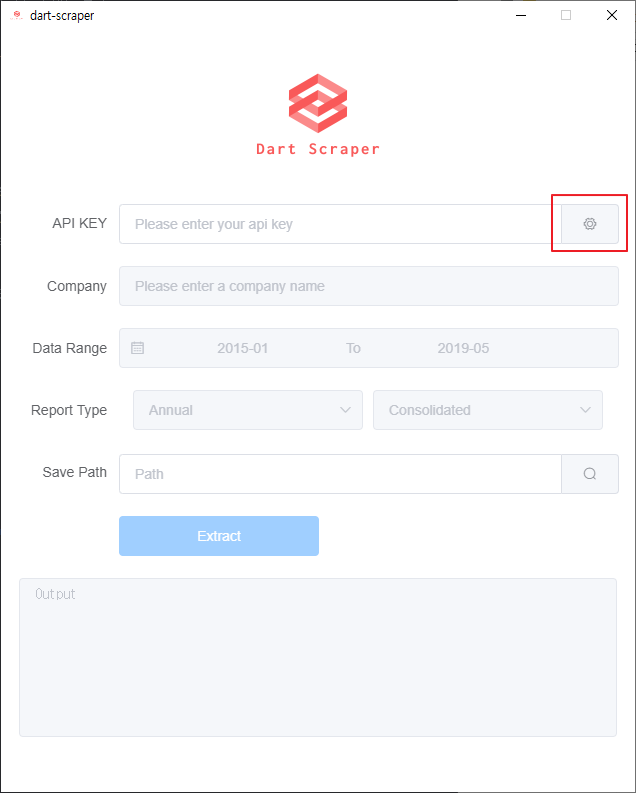
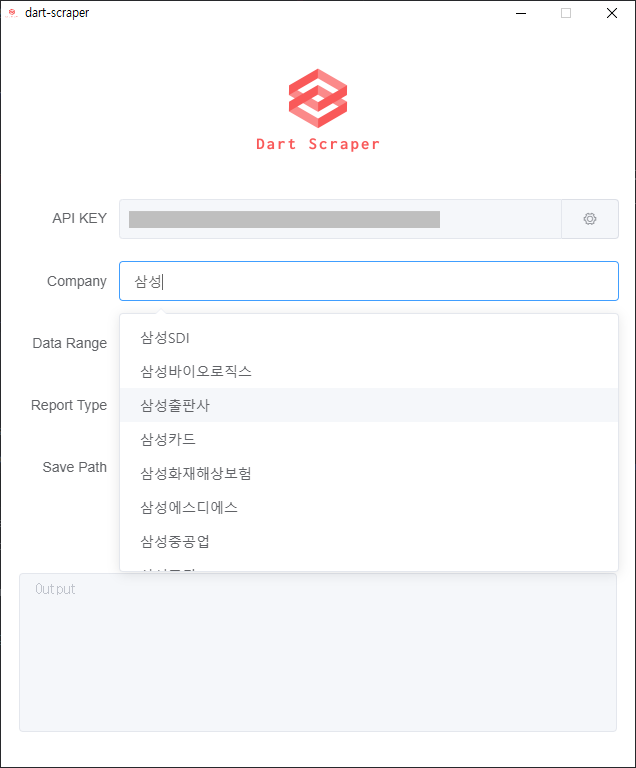
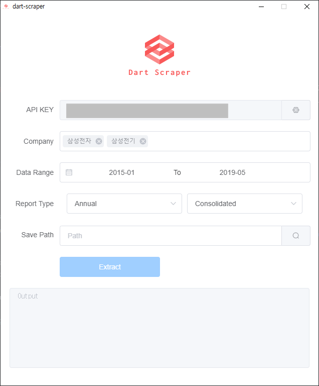
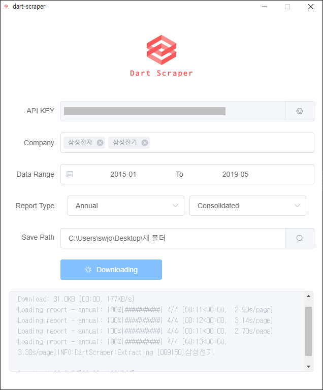
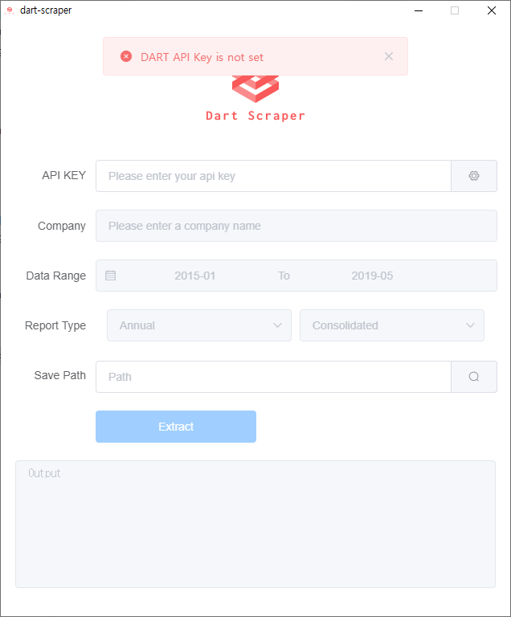

# Dart Scraper

[dart-fss](https://github.com/josw123/dart-fss) 모듈을 이용한 재무제표 추출 프로그램

## Version History
- v0.2.1
  - API Key 저장기능 추가(#3)
  - 동일 회사의 데이터를 동일파일에 시트로 구분(#2)
  - [Dart-Fss](https://github.com/josw123/dart-fss) 라이브러리 v0.1.7 사용 ([Update 정보](https://github.com/josw123/dart-fss/releases))

- v0.2.0 
  - 프로그램 UI 전면 수정
  - 여러 회사를 한번에 다운로드 하는 기능 추가
  - (Bug)macOS에서 환경변수에 저장된 API KEY를 불러오지 못하는 버그

- first release(alpha)
  - http://dart.fss.or.kr의 오픈 API KEY 필요
  - 환경변수 DART_API_KEY 설정

## 프로그램 테스트 환경

-   Windows 10
-   macOS Mojave

## 환경설정을 통해 API_KEY 설정(Windows 10)

1.  [DART 오픈API](http://dart.fss.or.kr/dsap001/intro.do)에서 오픈API 신청

2.  "내 PC"에서 오른쪽 버튼-> 속성

3.  "시스템"에서 고급 시스템 설정 클릭

4.  "시스템 속성"에서 환경 변수 클릭

5.  "환경 변수"에서 새로 만들기 클릭

6.  변수이름: DART_API_KEY / 변수 값: 오픈API 인증키 입력후 확인

7.  환경변수 설정완료후 아래와 그림과 같이 변수가 등록되어 있어야 됩니다. 이후 확인버튼을 눌리시면 등록이 완료 됩니다.

## 프로그램 실행법

1. API_KEY 로딩을 위해 붉은색 버튼 클릭.

2.  API_KEY 설정이 필요한경우 API_KEY 입력후 붉은색 버튼 클릭

3. 회사 검색 - 키워드 입력후 Enter

4. 회사 선택 - 선택목록중 선택, 다중선택 가능

5. Extract 버튼 클릭

## 오류관련 팝업

1. "Please try again later": Background process가 로딩중인 상태 -> 로딩버튼 다시 클릭

2. "DART API Key is not set": Dart API Key가 설정되지 않은 상태

## 알러진 버그
- macOS에서 환경변수로 입력된 API KEY 값을 불러오지 못하는 버그

