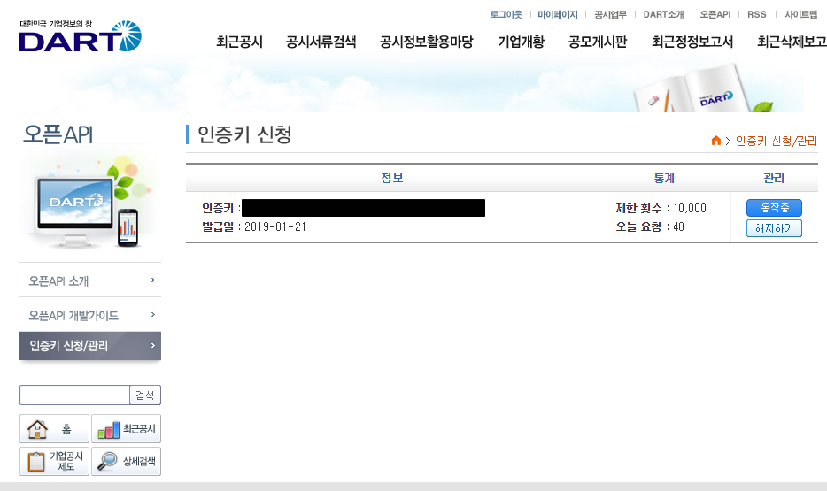
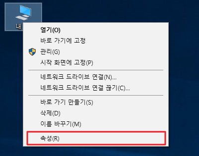
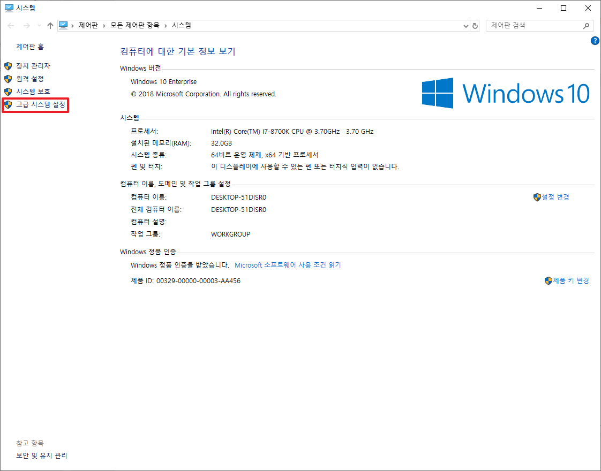
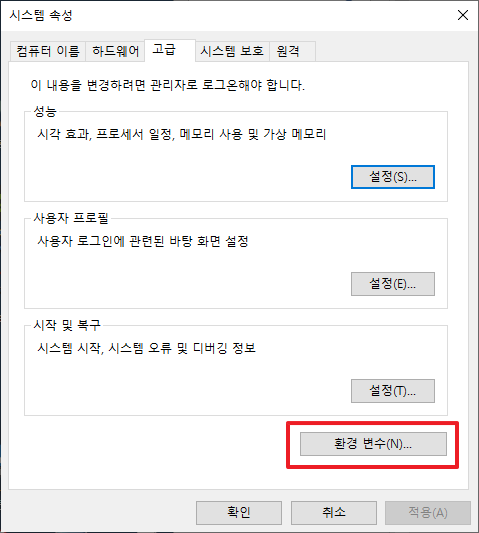
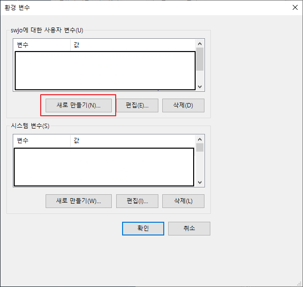
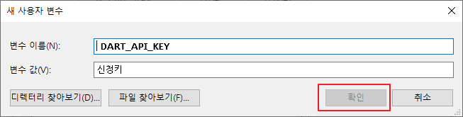
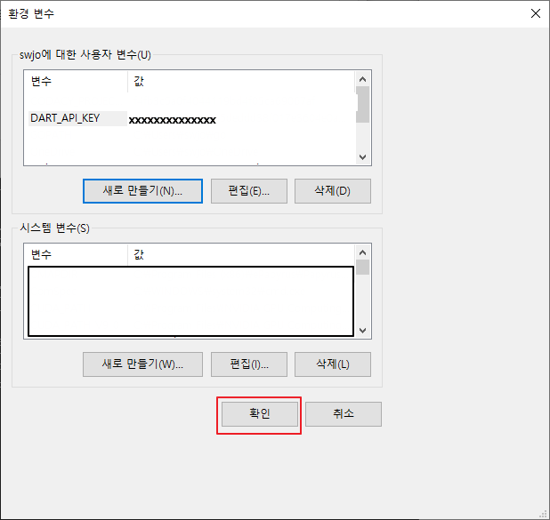
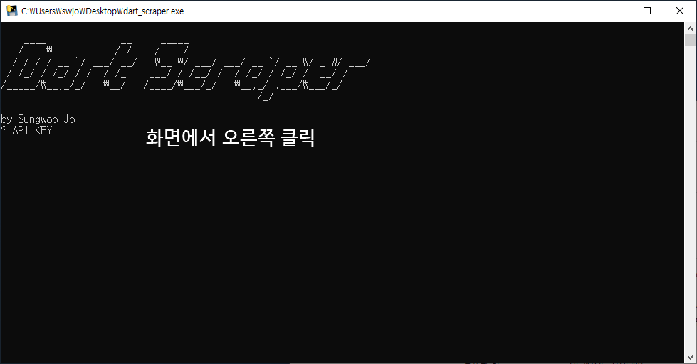
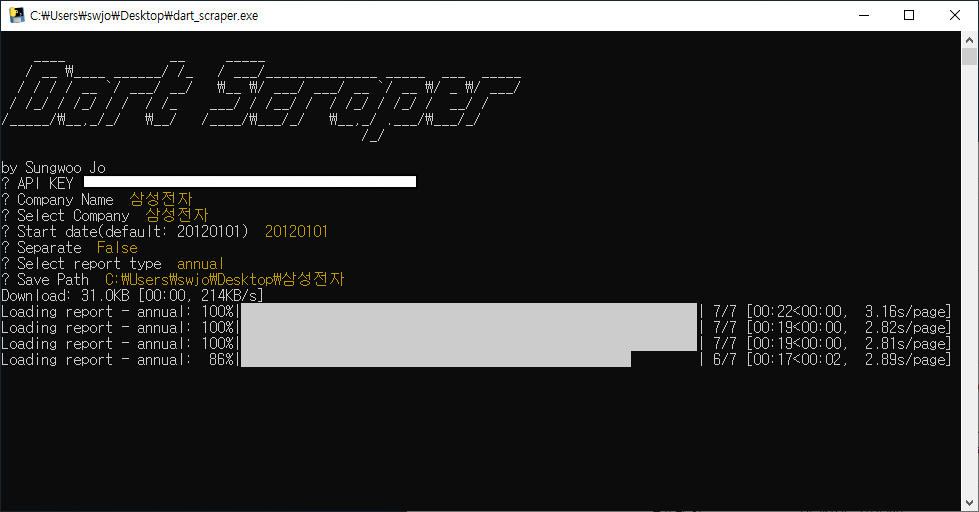

# Dart Scraper

dart-fss 모듈을 이용한 재무제표 추출 프로그램

## 프로그램 테스트 환경

-   Windows 10
-   macOS Mojave

## 환경설정을 통해 API_KEY 설정(Windows 10)

1.  [DART 오픈API](http://dart.fss.or.kr/dsap001/intro.do)에서 오픈API 신청

2.  "내 PC"에서 오른쪽 버튼-> 속성

3.  "시스템"에서 고급 시스템 설정 클릭

4.  "시스템 속성"에서 환경 변수 클릭

5.  "환경 변수"에서 새로 만들기 클릭

6.  변수이름: DART_API_KEY / 변수 값: 오픈API 인증키 입력후 확인

7.  환경변수 설정완료후 아래와 그림과 같이 변수가 등록되어 있어야 됩니다. 이후 확인버튼을 눌리시면 등록이 완료 됩니다.

## 프로그램상에서 직접 입력(환경변수가 설정되어 있지 않은 경우)

-   인증키 복사(Ctrl+C)
-   프로그램상에서 오른쪽 버튼 클릭

## 프로그램 동작
-   Company Name: 회사이름
-   Select Compnay: 검색된 회사이름중 선택
-   Start date: YYYYMMDD 형색으로 입력
-   Separate: True 개별재무제표 / False 연결재무제표
-   Select report type: 사업보고서 / 반기 / 분기
-   Save Path: 저장경로

