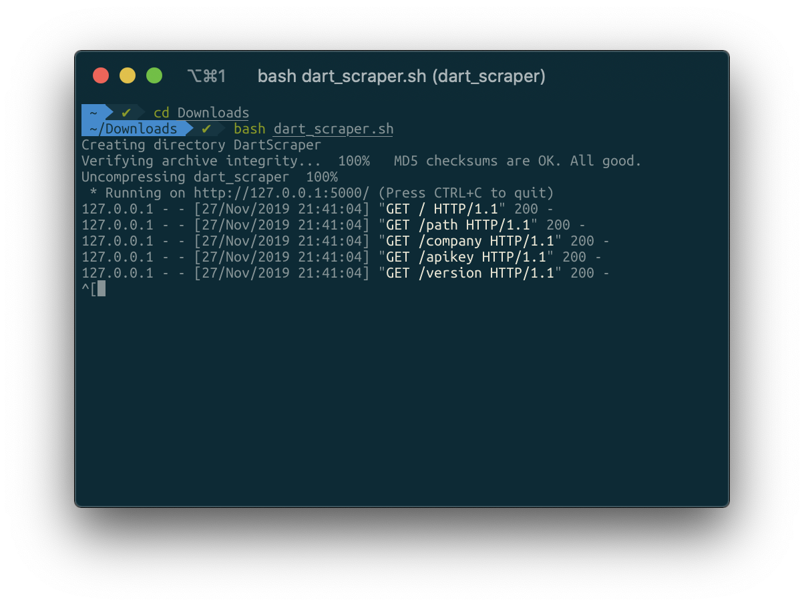
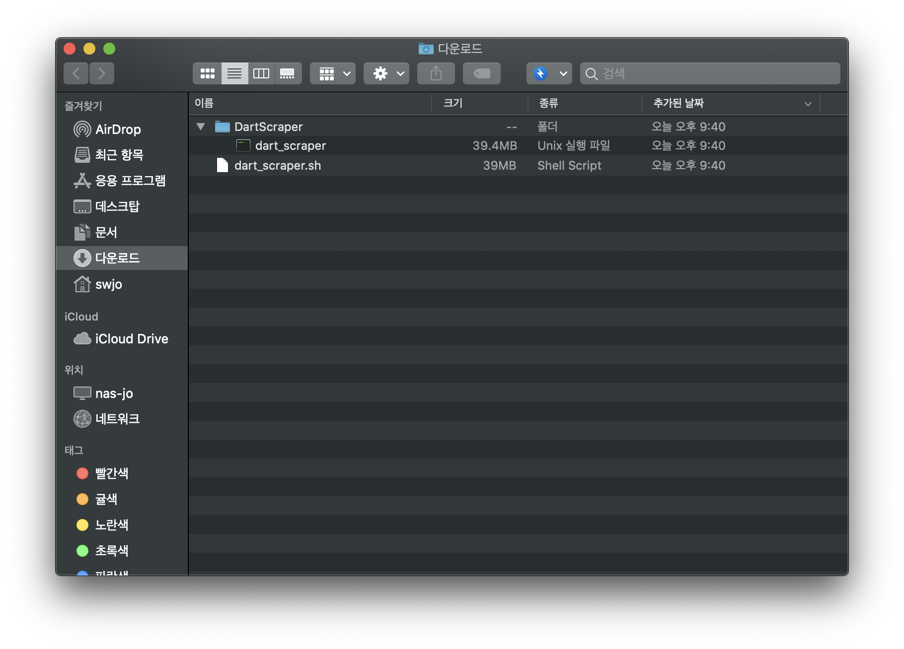
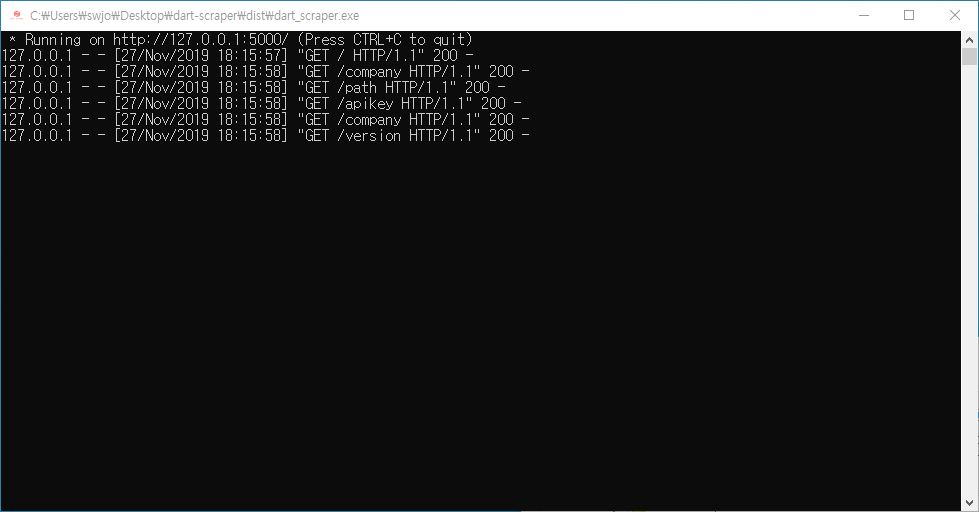
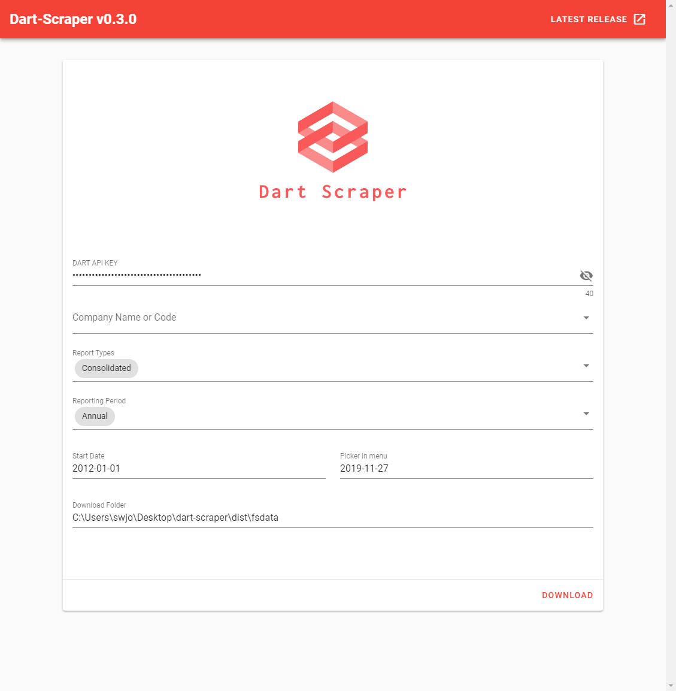
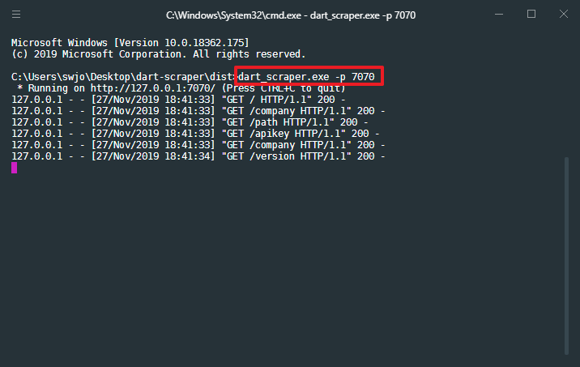

# Dart Scraper

[Dart-Fss](https://github.com/josw123/dart-fss) 모듈을 이용한 재무제표 추출 프로그램

## Download

[Download Link](https://github.com/josw123/dart-scraper/releases)

## Version History
- v0.3.0
  - [Dart-Fss](https://github.com/josw123/dart-fss) 라이브러리 v0.2.4 사용 ([Update 정보](https://github.com/josw123/dart-fss/releases/tag/v0.2.4))

- v0.2.3
  - 재무제표 추출 속도 개선
  - [Dart-Fss](https://github.com/josw123/dart-fss) 라이브러리 v0.1.9 사용 ([Update 정보](https://github.com/josw123/dart-fss/releases/tag/v0.1.9))

- v0.2.2
  - 저장된 API Key를 불러오지 못하는 버그 수정(#4)
  - [Dart-Fss](https://github.com/josw123/dart-fss) 라이브러리 v0.1.8 사용 ([Update 정보](https://github.com/josw123/dart-fss/releases/tag/v0.1.8))


- v0.2.1
  - API Key 자동저장기능 추가(#3)
  - 동일 회사의 데이터를 동일파일에 시트로 구분(#2)
  - [Dart-Fss](https://github.com/josw123/dart-fss) 라이브러리 v0.1.7 사용 ([Update 정보](https://github.com/josw123/dart-fss/releases/tag/v0.1.7))

- v0.2.0 
  - 프로그램 UI 전면 수정
  - 여러 회사를 한번에 다운로드 하는 기능 추가
  - (Bug)macOS에서 환경변수에 저장된 API KEY를 불러오지 못하는 버그


- first release(alpha)
  - http://dart.fss.or.kr의 오픈 API KEY 필요
  - 환경변수 DART_API_KEY 설정

## 프로그램 테스트 환경

-   Windows 10 1903
-   macOS Mojave

## DART API 신청
1. [DART API 신청](https://dart.fss.or.kr/dsag002/insertForm.do)

2. [API Key 확인](http://dart.fss.or.kr/dsap001/apikeyManagement.do)


## 설치

### Windows

- dart_scraper.exe 다운로드 후 실행

### macOS

- dart_scraper.sh 다운로드

- Terminal 실행 후 아래 명령어 입력(다운로드 폴더로 이동 후)

```bash
> bash dart_scraper.sh # 또는 sh dart_scraper.sh
```



- 최초 실행 이후 DartScraper 폴더의 dart_scraper 파일 실행



## 프로그램 사용법



- Dart Scraper 실행시 Local Webservice 실행




- DART API KEY 입력

- 재무제표를 다운받을 회사 선택

- 개별(Separate) / 별도(Consolidated) 재무제표 선택 (동시선택 가능)

- 연간보고서(Annual) / 반기보고서(Half) / 분기보고서(Quarter) 선택

> 반기보고서는 연간보고서 내용을 포함하고 있음

> 분기보고서는 연간보고서 및 반기보고서 내용을 포함하고 있음

- 추출 시작일(Start Date) / 추츨 종료일(End Date)

- 다운로드 폴더 경로(Download Folder)

## 포트 변경

- 기본 포트 5000 / 오류 발생시 아래와 같이 포트 변경

``` bash
> dart_scraper.exe -p 포트번호
```


